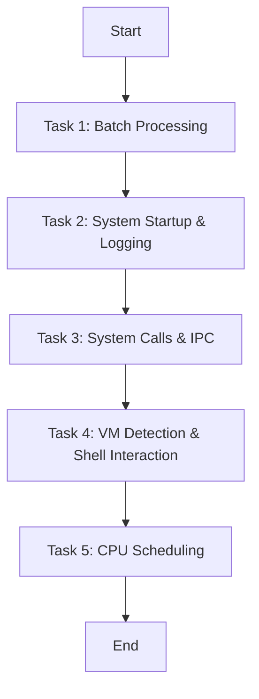

# OS Lab Assignment 4

ENCS351 Operating System Lab – Sheet 4 (Report)

# ** Name:Yatharth Chopra **
# ** Roll No.:2301420022 **
# ** Program: B.Tech (CSE/DS) **
# ** Date Submitted:10-11-2025 **

Task 1: Batch Processing

Approach: Sequential subprocess execution of Python scripts.
Evidence (screenshot refs): screenshots/task1.png
Output snippet: See outputs/task1_batch_output.txt.

Task 2: System Startup & Logging

Approach: multiprocessing to spawn processes, logging to a file.
Evidence: screenshots/task2.png
Log file: outputs/system_log.txt.

Task 3: System Calls & IPC

Approach: C program demonstrating fork(), exec(), wait() and pipe; Python alternative with os.pipe + os.fork.
Evidence: screenshots/task3_exec.png, screenshots/task3_pipe.png
Outputs: outputs/task3_exec.txt, outputs/task3_pipe.txt.

Task 4: VM Detection & Shell Interaction

Approach: sysinfo.sh prints kernel/user/virt line; vm_detect.py uses systemd-detect-virt, CPU hypervisor flag, and DMI strings.
Evidence: screenshots/task4.png
Outputs: outputs/task4_sysinfo.txt, outputs/task4_vmdetect.txt.

Task 5: CPU Scheduling (FCFS, SJF, RR, Priority)

Approach: Non-preemptive FCFS/SJF/Priority; Round Robin with quantum. Calculates WT & TAT, averages.
Evidence: screenshots/task5_fcfs.png, screenshots/task5_sjf.png, screenshots/task5_rr.png, screenshots/task5_priority.png
Outputs: outputs/task5_*.txt.

Observations & Learnings

Batch processing simulates simple job queues.

Logging shows lifecycle of processes like OS boot/shutdown.

fork/exec/wait separate address spaces; pipes enable IPC.

VM detection is heuristic-based; multiple signals increase confidence.

Scheduling policies trade fairness vs. turnaround; RR improves responsiveness; SJF minimizes average WT when bursts known.

References

Linux man fork, man exec, man wait, man pipe

Python docs: multiprocessing, subprocess, os
